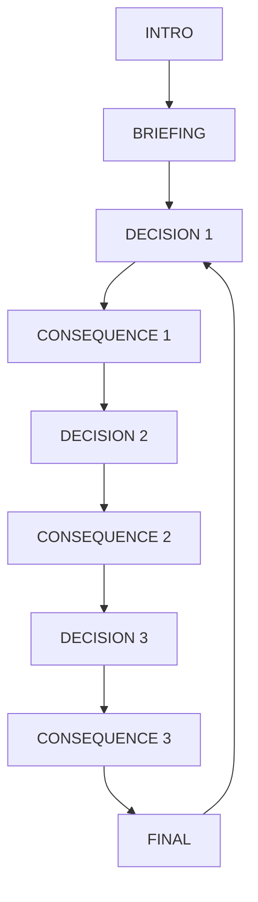

# GAME_SPEC.md — Municipio al Límite

> Especificación funcional y técnica para construir el MVP del juego educativo de la presentación sobre la Ley de Competencias y el Sistema General de Participaciones (SGP).

| Campo | Definición |
|---|---|
| Estado | Listo para implementación |
| Versión | 1.0.0 |
| Fecha | 2026-08-09 |
| Idioma | Español de Colombia (`es-CO`) |
| Duración objetivo | 2–3 minutos por partida |
| Plataforma | Navegador web, móvil primero |
| Distribución | Página estática accesible mediante QR |
| Backend | No requerido |
| Dependencias | Preferiblemente ninguna; HTML, CSS y JavaScript vanilla |

---

## 0. Cómo usar esta especificación

Este documento es la fuente de verdad para implementar el MVP. Las decisiones aquí definidas son normativas:

- `MUST` / **debe**: requisito obligatorio.
- `SHOULD` / **debería**: recomendación importante, modificable solo si existe una razón técnica clara.
- `MAY` / **puede**: decisión opcional que no debe ampliar el alcance del MVP.

El objetivo es implementar primero el motor de reglas y luego la interfaz. No se deben agregar cuentas, backend, aleatoriedad ni nuevas mecánicas antes de cumplir todos los criterios de aceptación de este documento.

Si el código existente contradice esta especificación, se debe inspeccionar primero y conservar lo compatible. No se deben borrar funcionalidades sin documentar la razón.

## 1. Resumen del producto

### 1.1 Premisa

El jugador gobierna un municipio ficticio durante tres momentos de una transición de doce años. El municipio recibirá más recursos del SGP, pero también deberá asumir más responsabilidades.

La pregunta central es:

> ¿Qué ocurre cuando llegan más recursos, pero las responsabilidades crecen más rápido que la capacidad institucional?

### 1.2 Objetivo pedagógico

Al terminar la partida, el jugador debe comprender por experiencia que:

1. Más transferencias no garantizan por sí solas mejores servicios.
2. Las competencias deben estar acompañadas de recursos suficientes, capacidad institucional, tiempos de transición y controles.
3. Una decisión que mejora el bienestar inmediatamente puede debilitar la sostenibilidad fiscal o institucional.
4. Fortalecer la capacidad administrativa puede producir menos impacto visible al principio, pero sostener mejor las responsabilidades futuras.

La aplicación no debe explicar todo mediante texto. El aprendizaje debe surgir de la secuencia:

```text
decisión → cambio visible → nueva presión → ajuste → resultado final
```

### 1.3 Efecto buscado: “despeinar” al público

La experiencia debe provocar una reacción semejante a:

> “¿Cómo así que recibir más plata también puede convertirse en un problema?”

No se busca un quiz con respuestas correctas ni una pantalla de “ganaste/perdiste”. Se busca que el jugador observe el costo de gobernar y llegue al dilema por medio de sus propias decisiones.

### 1.4 Referencia de diseño

La referencia conceptual es **Journey 2050**: decisiones breves, indicadores que cambian, consecuencias visibles y un resultado que permite interpretar la trayectoria. Se conserva el ciclo de simulación, pero se adapta a la descentralización fiscal colombiana y a una partida de 2–3 minutos.

## 2. Contexto narrativo y límites de contenido

### 2.1 Información que el juego puede comunicar

El briefing debe presentar estas ideas, con lenguaje breve:

- El Acto Legislativo 03 de 2024 estableció una transición gradual del SGP hacia el 39,5 % de los ingresos corrientes de la Nación.
- Llegar a ese porcentaje no significa que las regiones ya estén recibiendo el 39,5 %.
- La Ley de Competencias debe definir qué funciones corresponden a la Nación, los departamentos, los municipios, los distritos y los territorios indígenas, y cómo se financian.
- El 29 de julio de 2026 se radicó un proyecto de Ley de Competencias.
- El 31 de julio de 2026 se anunció que ese texto sería retirado para construir otro con mayor concertación.

### 2.2 Guardrails jurídicos y periodísticos

La interfaz y el texto del juego deben respetar estas expresiones:

| Usar | No usar |
|---|---|
| “Proyecto de Ley de Competencias” | “Ley de Competencias aprobada” |
| “Se anunció que el proyecto será retirado” | “El proyecto ya fue retirado formalmente” |
| “La reforma establece una transición hacia el 39,5 %” | “Las regiones ya reciben el 39,5 %” |
| “El texto específico está en discusión” | “La reforma constitucional desapareció” |

El tono debe ser institucional y explicativo, no partidista. La aplicación representa un dilema de política pública; no debe presentar a una corriente política como la única responsable del problema.

### 2.3 Simplificaciones permitidas

Los valores del juego son unidades abstractas. No representan pesos colombianos ni una distribución legal exacta.

La secuencia visual `29,5 % → 32,8 % → 36,2 % → 39,5 %` es una representación compacta de la transición para una partida de tres rondas. Debe mostrarse como **hitos de simulación**, no como una tabla oficial año por año.

### 2.4 Fuentes de referencia para el contenido

Estas fuentes sirven para mantener el contexto de la presentación y revisar el copy si se actualiza el juego:

- [Semana — radicación del proyecto, 29 de julio de 2026](https://www.semana.com/economia/macroeconomia/articulo/gobierno-saliente-tambien-corrio-a-dejar-hecha-la-ley-de-competencias-de-las-regiones-minhacienda-radico-el-proyecto/202633/)
- [Semana — anuncio de retiro, 31 de julio de 2026](https://www.semana.com/semana-tv/semana-el-debate/articulo/rodrigo-lara-anuncio-que-retirara-la-ley-de-competencias-propuesta-por-el-gobierno-petro-que-es-y-por-que-las-regiones-celebran-el-anuncio/202627/)
- [Acto Legislativo 03 de 2024 — Senado de la República](https://www.secretariasenado.gov.co/senado/basedoc/acto_legislativo_03_2024.html)

## 3. Alcance del MVP

### 3.1 Incluido

- Una sola municipalidad ficticia.
- Tres rondas y exactamente tres decisiones por partida.
- Tres opciones por ronda.
- Cuatro indicadores de simulación.
- Cuatro hitos visuales del SGP.
- Consecuencias intermedias después de cada decisión.
- Cinco perfiles finales posibles.
- Reinicio inmediato de la partida.
- Funcionamiento local en cada dispositivo.
- Diseño responsive para celular y escritorio.
- Resultado determinista: las mismas decisiones producen el mismo resultado.

### 3.2 Fuera de alcance del MVP

No implementar todavía:

- Registro, inicio de sesión o perfiles.
- Base de datos o servidor.
- Tablero global entre participantes.
- Multijugador en tiempo real.
- Monedas o presupuestos expresados en pesos reales.
- Selección de varios tipos de municipio.
- Eventos aleatorios o resultados ocultos.
- Audio obligatorio, narrador o video.
- Sistema de logros, ranking o puntos competitivos.
- Distribución jurídica exacta del SGP por sector o territorio.
- Editor de escenarios para usuarios.

Estas funcionalidades pueden ser ideas futuras, pero no deben retrasar la partida demostrable de 2–3 minutos.

## 4. Criterios de éxito del producto

El MVP se considera exitoso si:

1. Un participante puede iniciar sin instrucciones externas y completar una partida en 2–3 minutos.
2. En cada ronda entiende que debe elegir entre beneficios que compiten entre sí.
3. Los cambios de los indicadores son visibles inmediatamente después de cada decisión.
4. El final conecta la trayectoria individual con el dilema de la Ley de Competencias.
5. La aplicación funciona mediante un enlace o QR sin instalar software.
6. La presentación puede explicar la teoría oralmente mientras el juego mantiene poco texto en pantalla.

## 5. Modelo de juego

### 5.1 Indicadores

Todos los indicadores, excepto el porcentaje del SGP, usan una escala de 0 a 100. Se deben limitar con `clamp(value, 0, 100)` después de cada cambio.

| Indicador | ID interno | Inicial | Qué representa |
|---|---:|---:|---|
| Bienestar de servicios | `wellbeing` | 50 | Calidad y percepción de los servicios que recibe la población. |
| Capacidad institucional | `capacity` | 40 | Personal, planeación, ejecución, coordinación y control. |
| Margen fiscal | `fiscalMargin` | 50 | Espacio para sostener gastos, responder a crisis y evitar fragilidad financiera. |
| Carga de competencias | `competencyLoad` | 35 | Responsabilidades que el municipio debe coordinar o ejecutar. Es una presión del contexto, no una “recompensa”. |

El jugador debe ver los cuatro indicadores, pero la carga de competencias debe tener un tratamiento visual distinto: funciona como una barra de presión o demanda, no como un indicador positivo.

### 5.2 Hitos de la transición

| Momento | Ronda visible | SGP mostrado | Carga de competencias |
|---|---:|---:|---:|
| Estado inicial | 0 | 29,5 % | 35 |
| Después de la ronda 1 | 1 | 32,8 % | 55 |
| Después de la ronda 2 | 2 | 36,2 % | 75 |
| Después de la ronda 3 | 3 | 39,5 % | 90 |

Reglas:

- El porcentaje se muestra con coma decimal en la interfaz (`29,5 %`).
- Internamente se puede almacenar como número (`29.5`).
- El aumento del SGP y de la carga ocurre al aplicar una decisión, antes de mostrar la siguiente ronda.
- La última consecuencia muestra el hito de 39,5 % y luego lleva a `FINAL`.

### 5.3 Presión institucional

La presión final se calcula así:

```js
institutionalPressure = Math.max(0, competencyLoad - capacity);
```

Una presión alta significa que las responsabilidades superan la capacidad disponible. Esta variable puede aparecer en el informe final como explicación, aunque no es obligatorio mostrarla como una quinta barra durante la partida.

### 5.4 Estado inicial

```js
{
  screen: "INTRO",
  currentRound: 0,
  sgp: 29.5,
  indicators: {
    wellbeing: 50,
    capacity: 40,
    fiscalMargin: 50,
    competencyLoad: 35
  },
  history: [],
  selectedDecisionId: null,
  lastConsequence: null,
  completed: false
}
```

Invariantes:

- `history.length` debe ser igual al número de decisiones aplicadas.
- `history.length` nunca puede superar 3.
- Una decisión aplicada no puede volver a aplicarse en la misma ronda.
- Los indicadores nunca salen del rango 0–100.
- No existe azar: no usar `Math.random()` en las reglas del juego.
- Recargar la página puede reiniciar la partida; no se requiere persistencia.

## 6. Decisiones y efectos exactos

Los efectos son unidades de simulación. La interfaz puede mostrar el intercambio de forma narrativa, pero el motor debe usar exactamente estos valores.

### 6.1 Ronda 1 — Llega el primer incremento

**Pregunta:** “El primer incremento llega. ¿Qué financias primero?”

| ID | Título visible | Copy breve | Δ bienestar | Δ capacidad | Δ margen | Etiquetas |
|---|---|---|---:|---:|---:|---|
| `r1_services_now` | Servicios visibles | “Resultados que la gente puede ver hoy.” | +14 | -6 | -10 | `short_term`, `visible_result` |
| `r1_build_capacity` | Fortalecer la alcaldía | “Personal, planeación y control para sostener lo que viene.” | +3 | +14 | -8 | `capacity`, `long_term` |
| `r1_reserve_coordinate` | Reservar y coordinar | “Proteger el margen mientras se organiza la respuesta.” | -4 | +6 | +12 | `prudence`, `coordination` |

Consecuencias narrativas sugeridas:

- `r1_services_now`: “La ciudadanía ve resultados rápidos, pero la alcaldía empieza a operar con menos margen y menos capacidad instalada.”
- `r1_build_capacity`: “La mejora es menos visible al principio, pero ahora hay más planeación y control para asumir nuevas tareas.”
- `r1_reserve_coordinate`: “Evitaste gastar todo de inmediato. La necesidad sigue visible, pero conservas espacio para coordinar y responder.”

Al continuar, la aplicación debe mostrar el hito `32,8 %` y aumentar la carga a `55`.

### 6.2 Ronda 2 — Aparece una nueva competencia

**Pregunta:** “Una nueva responsabilidad aparece: coordinar agua y saneamiento básico. ¿Cómo la implementas?”

| ID | Título visible | Copy breve | Δ bienestar | Δ capacidad | Δ margen | Etiquetas |
|---|---|---|---:|---:|---:|---|
| `r2_assume_now` | Asumirla de inmediato | “Responder rápido, aunque el equipo todavía no esté listo.” | +15 | -9 | -12 | `short_term`, `risk` |
| `r2_phase` | Implementarla por fases | “Avanzar gradualmente para no romper la operación.” | +7 | +7 | -5 | `phased`, `capacity` |
| `r2_cofinance` | Coordinar y cofinanciar | “Distribuir el esfuerzo y proteger el margen.” | +4 | +10 | +1 | `coordination`, `cofinance` |

Consecuencias narrativas sugeridas:

- `r2_assume_now`: “El servicio se expande rápido, pero el equipo recibe una carga que no estaba preparado para sostener.”
- `r2_phase`: “La implementación gradual reduce el impacto inmediato y protege la continuidad del servicio.”
- `r2_cofinance`: “La coordinación distribuye el esfuerzo y protege el margen, pero exige negociar y planear.”

Al continuar, la aplicación debe mostrar el hito `36,2 %` y aumentar la carga a `75`.

### 6.3 Ronda 3 — La prueba de realidad

**Pregunta:** “Una crisis de servicio y una auditoría de ejecución ponen a prueba al municipio. ¿Qué haces?”

| ID | Título visible | Copy breve | Δ bienestar | Δ capacidad | Δ margen | Etiquetas |
|---|---|---|---:|---:|---:|---|
| `r3_emergency` | Apagar el incendio | “Resolver lo urgente y dejar la reestructuración para después.” | +12 | -7 | -14 | `short_term`, `emergency` |
| `r3_audit_replan` | Auditar y replanificar | “Aceptar un costo inmediato para corregir la estructura.” | -6 | +13 | +5 | `control`, `long_term` |
| `r3_request_support` | Pedir apoyo y cofinanciar | “Compartir el riesgo para no cargarlo todo en el municipio.” | +5 | +7 | +8 | `coordination`, `risk_sharing` |

Consecuencias narrativas sugeridas:

- `r3_emergency`: “Apagaste el incendio. El problema visible baja, pero la estructura queda más vulnerable ante la próxima crisis.”
- `r3_audit_replan`: “El control no luce como una obra, pero permite corregir la ejecución y evitar que el problema se repita.”
- `r3_request_support`: “Compartir riesgos no resuelve todo hoy, pero evita que el municipio cargue solo con una responsabilidad que excede su capacidad.”

Al aplicar esta decisión, la aplicación debe mostrar el hito final `39,5 %`, aumentar la carga a `90` y pasar a `FINAL` después de la pantalla de consecuencia.

## 7. Resultado final

### 7.1 Fórmula de clasificación

La clasificación debe ser determinista y evaluarse en este orden:

```js
pressure = Math.max(0, competencyLoad - capacity);

if (
  fiscalMargin <= 24 ||
  capacity <= 34 ||
  pressure >= 50
) {
  outcome = "municipio_al_limite";
} else if (
  wellbeing >= 60 &&
  capacity >= 60 &&
  fiscalMargin >= 40 &&
  pressure <= 35
) {
  outcome = "descentralizacion_viable";
} else if (
  wellbeing >= 70 &&
  (capacity < 55 || fiscalMargin < 35)
) {
  outcome = "bienestar_fragil";
} else if (
  capacity >= 65 &&
  wellbeing < 60
) {
  outcome = "capacidad_sin_resultados";
} else {
  outcome = "descentralizacion_inconclusa";
}
```

No se debe presentar el resultado como una nota académica ni como una condena moral. Es un perfil de trayectoria.

### 7.2 Perfiles y copy

| ID | Título | Interpretación | Conexión pedagógica |
|---|---|---|---|
| `descentralizacion_viable` | Descentralización viable | El municipio aumentó su capacidad al ritmo de las responsabilidades y conservó margen para sostenerlas. | Los recursos funcionan mejor cuando llegan con capacidad, planeación y reglas claras. |
| `municipio_al_limite` | Municipio al límite | La respuesta inmediata mejoró, pero la carga final supera la capacidad o el margen disponible. | Transferir responsabilidades sin financiación y capacidad puede convertir el aumento de recursos en presión. |
| `bienestar_fragil` | Bienestar frágil | La población percibió mejoras, pero el resultado depende demasiado de decisiones de corto plazo. | Un resultado visible no equivale a sostenibilidad. |
| `capacidad_sin_resultados` | Capacidad sin resultados | Se fortaleció la estructura, pero el bienestar no mejoró suficientemente durante la transición. | La capacidad es necesaria, pero debe traducirse en servicios y bienestar. |
| `descentralizacion_inconclusa` | Descentralización inconclusa | Se evitó el colapso, pero no se equilibraron completamente bienestar, capacidad y margen. | La norma debe definir competencias, recursos, tiempos y controles; no existe una solución aislada. |

### 7.3 Estructura de la pantalla final

La pantalla `FINAL` debe mostrar, en este orden:

1. Título del perfil.
2. Una frase breve explicando la trayectoria.
3. Las cuatro métricas finales.
4. La presión institucional final (`carga - capacidad`), si es mayor que cero.
5. Una frase de conexión con la Ley de Competencias.
6. Botón **Jugar otra vez**.

Copy común de cierre:

> “La reforma puede mover más recursos hacia las regiones. La discusión decisiva es qué competencias se transfieren, cuánto cuesta ejercerlas y si existen capacidades y controles para hacerlo.”

## 8. Estados de la aplicación

### 8.1 Máquina de estados



### 8.2 Contrato por estado

| Estado | Debe mostrar | Acciones permitidas | Transición |
|---|---|---|---|
| `INTRO` | Nombre, subtítulo “12 años · 3 decisiones · 1 dilema” y CTA. | `Comenzar`. | `BRIEFING`. |
| `BRIEFING` | Contexto breve de SGP, proyecto y dilema. | `Gobernar el municipio`. | `DECISION` de ronda 1. |
| `DECISION` | Ronda, hito SGP actual, carga, cuatro indicadores y tres tarjetas. | Seleccionar una tarjeta; confirmar una vez. | `CONSEQUENCE` de la misma ronda. |
| `CONSEQUENCE` | Cambio de cada métrica, narrativa y próxima presión. | `Continuar`. | Próxima `DECISION` o `FINAL` después de ronda 3. |
| `FINAL` | Perfil, métricas finales, interpretación y CTA. | `Jugar otra vez`. | `DECISION` de ronda 1 con estado nuevo. |

Reglas de interacción:

- El jugador no puede confirmar sin seleccionar una opción.
- Una tarjeta seleccionada debe tener un estado visual claro.
- Confirmar una opción debe bloquear temporalmente la interacción para impedir doble aplicación.
- La pantalla de consecuencia no debe permitir modificar retrospectivamente la decisión.
- El botón de reinicio debe limpiar completamente el historial y todas las métricas.

## 9. Requisitos funcionales

| ID | Requisito |
|---|---|
| `FR-01` | El juego debe iniciar sin registro, configuración ni permisos especiales. |
| `FR-02` | Una partida debe contener exactamente tres decisiones. |
| `FR-03` | Cada ronda debe presentar exactamente tres opciones. |
| `FR-04` | Cada opción debe tener al menos un beneficio y un costo. |
| `FR-05` | La aplicación debe mostrar el porcentaje del SGP durante toda la partida. |
| `FR-06` | La carga de competencias debe aumentar de 35 a 55, 75 y 90. |
| `FR-07` | Los cuatro indicadores deben actualizarse después de cada decisión. |
| `FR-08` | Cada decisión debe producir una pantalla de consecuencia antes de permitir continuar. |
| `FR-09` | El resultado final debe depender del historial de decisiones y de los indicadores finales. |
| `FR-10` | Las reglas deben ser deterministas y no depender de una API ni de aleatoriedad. |
| `FR-11` | El juego debe permitir reiniciar inmediatamente desde la pantalla final. |
| `FR-12` | El estado de una partida debe existir localmente en el navegador. |
| `FR-13` | La aplicación debe funcionar sin backend, cuentas ni base de datos. |
| `FR-14` | La interfaz debe estar en español y usar coma decimal para los porcentajes visibles. |
| `FR-15` | El briefing y el cierre deben respetar los guardrails jurídicos de la sección 2.2. |

## 10. Requisitos no funcionales

### 10.1 Usabilidad

- Mobile first; objetivo principal: pantallas de 320–430 px de ancho.
- También debe funcionar en escritorio con un contenedor centrado de ancho máximo aproximado de 960 px.
- Los botones y tarjetas deben tener un área táctil mínima de 44 × 44 px.
- La información debe priorizar números grandes, barras y frases cortas.
- No usar párrafos largos dentro de las tarjetas de decisión.
- La partida no debe depender de audio.
- El jugador debe poder completar la partida con una mano en el celular.

### 10.2 Rendimiento y despliegue

- Carga rápida desde GitHub Pages o cualquier hosting estático.
- No añadir un framework o bundler si no existe una razón justificada.
- No depender de imágenes externas para que el juego funcione.
- Evitar fuentes, librerías, videos o assets pesados.
- No debe haber errores en la consola durante el flujo normal.

### 10.3 Accesibilidad

- Usar HTML semántico y botones reales, no `div` simulando botones.
- Todos los controles deben poder usarse con teclado.
- Mantener un indicador visible de foco.
- No comunicar estados únicamente mediante color.
- Añadir `aria-label` o texto equivalente cuando el significado de una barra no sea obvio.
- Respetar `prefers-reduced-motion` y ofrecer una versión sin animaciones intensas.
- Mantener contraste suficiente entre texto, fondo y estados de decisión.

### 10.4 Identidad visual sugerida

La estética debe recordar un reportaje de actualidad y un tablero cívico, sin parecer una hoja de cálculo.

Tokens sugeridos:

```css
:root {
  --color-ink: #10202b;
  --color-paper: #f4f1ea;
  --color-panel: #ffffff;
  --color-accent: #f36f56;
  --color-positive: #2e9b73;
  --color-warning: #d9982b;
  --color-negative: #d9534f;
  --radius-card: 18px;
  --shadow-card: 0 10px 30px rgba(16, 32, 43, 0.12);
}
```

Los tokens pueden ajustarse si el proyecto ya tiene una identidad visual, pero la prioridad debe ser claridad, contraste y lectura rápida.

## 11. Arquitectura técnica

### 11.1 Archivos base

Mantener una estructura pequeña y explícita:

```text
.
├── index.html
├── app.js
├── styles.css
├── GAME_SPEC.md
└── README.md
```

Si se agregan pruebas automatizadas, pueden ubicarse en `tests/`, pero no se debe introducir una cadena de herramientas compleja solo para probar nueve funciones simples.

### 11.2 Responsabilidades

#### `index.html`

- Contenedor raíz de la aplicación.
- Estructura semántica mínima.
- Sin reglas de negocio incrustadas.
- Carga de `styles.css` y `app.js`.

#### `styles.css`

- Layout responsive.
- Estados visuales de tarjetas, botones, barras y pantallas.
- Animaciones breves y opcionales.
- Media query para `prefers-reduced-motion`.

#### `app.js`

Separar claramente:

1. Configuración y datos de rondas.
2. Funciones puras del motor de reglas.
3. Estado actual de la aplicación.
4. Renderizado del DOM.
5. Eventos de interacción.

El renderizado no debe calcular reglas de negocio. Las reglas no deben depender de elementos del DOM.

### 11.3 API interna recomendada

Implementar funciones con responsabilidades equivalentes a estas:

```js
createInitialState()
startGame(state)
selectDecision(state, decisionId)
applyDecision(state, decisionId)
advanceFromConsequence(state)
getOutcome(state)
resetGame()
render(state)
```

Contrato de `applyDecision`:

```js
{
  state: nextState,
  consequence: {
    decisionId,
    changes: {
      wellbeing,
      capacity,
      fiscalMargin,
      competencyLoad,
      sgp
    },
    narrative,
    nextRound
  }
}
```

La función debe:

- Rechazar una decisión que no corresponda a la ronda actual.
- Aplicar los efectos exactamente una vez.
- Registrar una entrada en `history`.
- Actualizar el SGP y la carga del siguiente hito.
- Devolver los valores anteriores y nuevos para animar la consecuencia.

### 11.4 DOM y eventos

Usar atributos `data-*` para identificar acciones:

```html
<button data-action="select-decision" data-decision-id="r1_build_capacity">
  ...
</button>
```

Se recomienda delegación de eventos en el contenedor principal para evitar listeners duplicados al cambiar de pantalla.

## 12. Criterios de aceptación

Los siguientes escenarios deben poder verificarse manualmente o mediante pruebas automatizadas simples.

### `AC-01` — Inicio limpio

**Dado** que el usuario abre la página por primera vez, **cuando** carga la aplicación, **entonces** ve `INTRO`, no ve decisiones de una partida anterior y puede comenzar sin registrarse.

### `AC-02` — Briefing correcto

**Dado** que el usuario pulsa `Comenzar`, **entonces** ve el contexto del SGP, el paso visual de 29,5 % a 39,5 % y la distinción entre proyecto radicado y ley vigente.

### `AC-03` — Decisión obligatoria

**Dado** que el usuario está en una pantalla `DECISION`, **cuando** intenta continuar sin elegir, **entonces** la aplicación no avanza y comunica qué debe seleccionar.

### `AC-04` — Efectos exactos

**Dado** el estado inicial, **cuando** el usuario elige `r1_build_capacity`, **entonces** los indicadores quedan en bienestar 53, capacidad 54 y margen 42, y el siguiente hito queda en SGP 32,8 % con carga 55.

### `AC-05` — Una sola aplicación

**Dado** que una decisión ya fue confirmada, **cuando** el usuario hace doble clic o pulsa varias veces rápidamente, **entonces** el efecto se registra una sola vez en `history`.

### `AC-06` — Consecuencia visible

**Dado** que se confirma una decisión, **entonces** aparece `CONSEQUENCE` antes de la siguiente decisión y muestra la variación de cada indicador afectado.

### `AC-07` — Tres rondas exactas

**Dado** que el usuario completa las rondas 1 y 2, **entonces** la aplicación no muestra una ronda 4; después de la tercera consecuencia pasa a `FINAL`.

### `AC-08` — Resultado viable

**Dado** que el usuario elige esta trayectoria:

```text
r1_build_capacity → r2_phase → r3_request_support
```

**entonces** el estado final debe ser:

```text
wellbeing: 65
capacity: 68
fiscalMargin: 45
competencyLoad: 90
institutionalPressure: 22
outcome: descentralizacion_viable
```

### `AC-09` — Resultado al límite

**Dado** que el usuario elige:

```text
r1_services_now → r2_assume_now → r3_emergency
```

**entonces** el estado final debe ser:

```text
wellbeing: 91
capacity: 18
fiscalMargin: 14
competencyLoad: 90
institutionalPressure: 72
outcome: municipio_al_limite
```

### `AC-10` — Capacidad sin resultados

**Dado** que el usuario elige:

```text
r1_build_capacity → r2_phase → r3_audit_replan
```

**entonces** el estado final debe ser:

```text
wellbeing: 54
capacity: 74
fiscalMargin: 42
competencyLoad: 90
institutionalPressure: 16
outcome: capacidad_sin_resultados
```

### `AC-11` — Bienestar frágil

**Dado** que el usuario elige:

```text
r1_services_now → r2_phase → r3_request_support
```

**entonces** el estado final debe ser:

```text
wellbeing: 76
capacity: 48
fiscalMargin: 43
competencyLoad: 90
institutionalPressure: 42
outcome: bienestar_fragil
```

### `AC-12` — Determinismo

**Dado** que dos jugadores toman la misma secuencia, **entonces** obtienen exactamente los mismos indicadores, perfil y copy final, independientemente del dispositivo.

### `AC-13` — Reinicio

**Dado** que el usuario está en `FINAL`, **cuando** pulsa `Jugar otra vez`, **entonces** vuelve a la ronda 1 con los valores iniciales y un historial vacío.

### `AC-14` — Responsive y accesible

**Dado** un viewport de 320 px de ancho, **entonces** no debe existir scroll horizontal, las tarjetas deben ser utilizables y todos los botones deben tener foco y texto comprensible.

### `AC-15` — Copy jurídicamente seguro

**Dado** que el usuario lee el briefing y el cierre, **entonces** nunca debe interpretarse que el proyecto ya es una ley aprobada, que el retiro ya fue formalizado o que las regiones ya reciben el 39,5 %.

## 13. Estrategia de implementación

Implementar en este orden:

### Fase 1 — Motor de reglas

- Crear constantes de hitos, decisiones y perfiles.
- Crear `createInitialState`, `applyDecision`, `getOutcome` y `clamp`.
- Validar los cuatro caminos de aceptación antes de diseñar animaciones.

### Fase 2 — Máquina de estados

- Implementar `INTRO`, `BRIEFING`, `DECISION`, `CONSEQUENCE` y `FINAL`.
- Garantizar que cada transición sea explícita.
- Bloquear decisiones duplicadas y avances inválidos.

### Fase 3 — Interfaz mobile first

- Crear la jerarquía visual de cada pantalla.
- Añadir tarjetas de decisión, barras y hito SGP.
- Mantener texto corto y números grandes.

### Fase 4 — Consecuencias y pulido

- Mostrar cambios antes/después.
- Añadir animaciones breves sin bloquear la interacción.
- Añadir soporte para `prefers-reduced-motion`.
- Revisar contraste, foco y lectura en celular.

### Fase 5 — QA y entrega

- Ejecutar todos los criterios de aceptación.
- Probar ancho móvil y escritorio.
- Comprobar que no existan errores de consola.
- Actualizar `README.md` con instrucciones de ejecución local y despliegue estático.
- Verificar que la URL final pueda abrirse desde un QR.

## 14. Definition of Done

El MVP está terminado cuando:

- [ ] La partida completa tiene exactamente tres decisiones.
- [ ] El ciclo decisión → consecuencia se percibe con claridad.
- [ ] Las reglas están separadas del renderizado.
- [ ] Los hitos del SGP y la carga evolucionan correctamente.
- [ ] Los cinco perfiles finales funcionan con clasificación determinista.
- [ ] Los caminos `AC-08` a `AC-11` producen los valores esperados.
- [ ] No hay doble aplicación de decisiones.
- [ ] El reinicio funciona sin recargar la página.
- [ ] La interfaz funciona entre 320 px y 1.440 px sin romperse.
- [ ] Se puede jugar sin audio, sin cuenta y sin conexión a un backend.
- [ ] El copy respeta las precisiones jurídicas y periodísticas.
- [ ] El juego es suficientemente breve para integrarse en la presentación.
- [ ] El resultado final deja explícito que el reto no es solo transferir dinero, sino transferir competencias con recursos, capacidad, tiempos y controles.

## 15. Próximas iteraciones, fuera del MVP

Solo después de validar este MVP se podrían considerar:

- Dos arquetipos de municipio con capacidades iniciales distintas.
- Eventos alternativos deterministas por escenario.
- Modo proyección para que el expositor lo use en vivo.
- Comparación entre dos trayectorias de jugadores.
- Compartir el perfil final como imagen.
- Narrativa ampliada sobre departamentos, distritos y territorios indígenas.

Estas ideas no deben incorporarse automáticamente durante la primera implementación.
